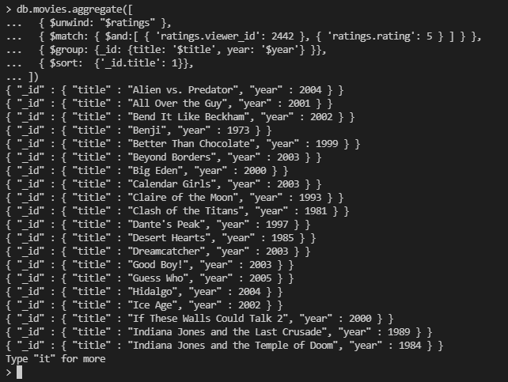

# Netflix Practice

## Queries

### Movies filtered by title and/or year:

> A query that retrieves the ID, year, and title of movies that fit criteria of your choosing (e.g., movies with certain titles or title patterns, movies released on one or more given years, etc.), sorted ascending by title.

```json
{
  "_source": false,
  "query": {
    "bool": {
      "must": [
        {
          "match": {
            "title": "spongebob"
          }
        }
      ]
    }
  },
  "sort": ["title.keyword", "year", "_id"]
}
```

Queries the title, release year, and id of the movies with "Spongebob" in the title.

<center></img></center>

### Number of movies released per year:

> A query that takes movie criteria of your choosing and returns a collection consisting of year and count where count is the number of movies that meet these criteria which were released on that year, sorted ascending by year.

```json
{
  "size": 0,
  "_source": false,
  "query": {
    "bool": {
      "must": [
        {
          "match": {
            "title": "spongebob"
          }
        }
      ]
    }
  },
  "aggs": {
    "movies_per_year": {
      "terms": {
        "field": "year"
      },
      "aggs": {
        "movies_per_year_sort": {
          "bucket_sort": {
            "sort": {
              "_key": {
                "order": "asc"
              }
            }
          }
        }
      }
    }
  }
}
```

Queries

<center></img></center>

### Years with the most movies released:

> A query that takes movie criteria of your choosing and returns the same collection as above except it only returns the year and count of the top five (5) years with the most movies released, sorted descending by count then ascending by year in case of a tie.

```json

```

Queries

<center></img></center>

### Movies rated a certain way by a specific user:

> A query that lists the title and year of movies seen by a particular user with a rating matching conditions of your choosing (e.g., 4 and above, 2 and below, etc.) sorted ascending by title.

```json
{
  "_source": false,
  "query": {
    "nested": {
      "path": "ratings",
      "query": {
        "bool": {
          "must": [
            {
              "match": {
                "ratings.viewer_id": 2442
              }
            },
            {
              "match": {
                "ratings.rating": 5
              }
            }
          ]
        }
      }
    }
  },
  "sort": ["title.keyword"]
}
```

Queries all reviews made by user '2442' with a rating of '5', sorted ascending by title

<center></img></center>

### Average rating of movies:

> A query that takes movie criteria of your choosing and returns a collection consisting of title, year, and avg where avg is the average rating received by each movie, sorted descending by avg (thus listing the top-rated movie first) then ascending by title in case of a tie.

```json

```

Queries

<center></img></center>

### Specific average rating of movies:

> A query that takes movie criteria of your choosing and returns a collection consisting of title, year, and avg where avg is the average rating received by each movie and meeting some condition of your choosing such as average greater than 4, average less than 3, etc.—the results should be sorted descending by avg (thus listing the top-rated movie first) then ascending by title in case of a tie.

```json

```

Queries

<center></img></center>

### Number of reviews received by a movie during a certain time period:

> A query that takes movie criteria of your choosing and returns a collection consisting of title, year, and count where count is the number of reviews received by each movie within a particular date range of your choosing such as after 2005, during the month of September, etc.—the results should be sorted descending by count (thus listing the most-frequently-rated movie first) then ascending by title in case of a tie.

```json

```

Queries

<center></img></center>
