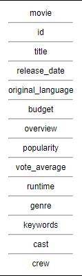

# Schema Diagram

# Collections

## Movie Collection

| Movie              | Description                                                                                        |
| ------------------ | -------------------------------------------------------------------------------------------------- |
| budget             | int                                                                                                |
| genre              | id:int, name:varchar                                                                               |
| homepage           | string                                                                                             |
| id                 | int                                                                                                |
| keywords           | id:int name:varchar                                                                                |
| original_language  | string                                                                                             |
| original_title     | string                                                                                             |
| overview           | string                                                                                             |
| popularity         | float                                                                                              |
| production_company | name:string, id:int                                                                                |
| production_country | encoding:string, name:string                                                                       |
| release_date       | date                                                                                               |
| revenue            | int                                                                                                |
| runtime            | int                                                                                                |
| spoken_languages   | encoding:string, name:string                                                                       |
| status             | string                                                                                             |
| tagline            | string                                                                                             |
| title              | varchar                                                                                            |
| vote_average       | double                                                                                             |
| vote_count         | int                                                                                                |
| cast               | cast_id: int, character: string, credit_id: int , gender: int , id: int, name: string , order: int |
| crew               | credit_id: string, department: string, gender: string, id: int, job: string, name: string          |

<!--

## Credit Collection

| Credit | Description                                                                                        |
| ------ | -------------------------------------------------------------------------------------------------- |
| id     | int                                                                                                |
| title  | string                                                                                             | -->
